<h1>  Hey, Nice to see you.  </h1>

I'm Weiyu 😉, Security Operation 👨🏻‍💻 from Hong Kong. I'm passionate about Linux and mostly develop in Python 🐍.

- 🔭 I’m currently working on interesting projects.
- 🌱 I’m currently learning Japanese, Email Security
- ⚡ Fun fact: I love cooking.

### Stats Overview : :cyclone:

